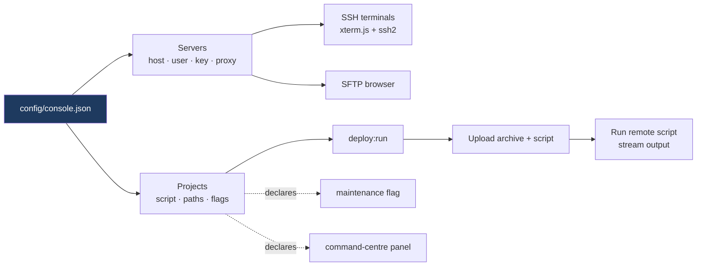

<div align="center">

# Bastion

**A desktop SSH console — multi-terminal, SFTP browser, and atomic deploys driven by a
project descriptor instead of a hardcoded fleet.**

[](https://github.com/Hundreak/Bastion/actions/workflows/ci.yml)
[](LICENSE)
[](package.json)
[](package.json)
[](#the-fleet-is-configuration)

</div>

---

Bastion opens SSH sessions to servers you define, gives each one a real terminal, browses
and edits remote files over SFTP, and runs one-click deploys that stream their output back
into the window.

## The fleet is configuration

This is the design decision the rest of the app hangs on.

The console began with its servers written into the renderer: three production hosts, two by
raw IP, each connecting as `root`, one carrying the filename of its private key and the
tunnel command that reached it. Alongside them sat four deploy handlers with the remote
directory layout of four live deployments compiled in.

None of that is source code. It is a description of one person's infrastructure, and a
repository is the wrong place for it — a bundle containing hosts, usernames, key paths and
remote layouts is a map of an attack surface, and no amount of access control on the servers
makes shipping it reasonable.

So a server is now a record in `config/console.json`, which is gitignored:

```json
{
  "servers": [
    { "id": "app-prod", "title": "Application server",
      "host": "app.example.com", "port": 22, "username": "deploy" },

    { "id": "tunnelled", "title": "Tunnelled server",
      "host": "ssh.example.com", "username": "deploy",
      "keyPath": "~/.ssh/deploy_key.pem",
      "proxyCommand": "cloudflared access ssh --hostname ssh.example.com" }
  ],
  "projects": [
    { "key": "example-web", "serverId": "app-prod", "label": "Example Web",
      "script": "example-remote-deploy.sh",
      "localProjectPath": "~/projects/example-web",
      "remoteDir": "/var/www/example-web/current",
      "maintenanceFlag": "/etc/example-web/maintenance.flag",
      "commandCenter": true }
  ]
}
```

`config/console.example.json` documents the full shape. Without a config file the app opens
on a localhost placeholder rather than refusing to start — a console you cannot launch is no
help when you are trying to configure it.

A CI job fails the build if a literal IP, an absolute home directory, a `root` default or a
committed `console.json` reappears in the source tree.

## What the descriptor buys



Four deploy handlers became one. They had been the same sequence — check the local tree, tar
it, upload the archive and the script, run it, stream the output — with different constants
baked in, so a fifth product meant copying the file again and a fix to the upload path was
three edits that could disagree.

Capability follows the descriptor rather than the name:

- a project with a `maintenanceFlag` gets a maintenance switch; one without has none, and
  the UI does not offer it
- a project with `commandCenter: true` gets the dedicated panel
- a project the config does not define does not exist as far as the deploy handler is
  concerned

Values that reach a shell are validated rather than trusted: the deploy script name is taken
as a basename so a descriptor cannot name `../../etc/anything`, and a maintenance flag must
be an absolute path with no traversal and no shell metacharacters.

## Deploys

`electron/scripts/example-remote-deploy.sh` is a worked example, and the part worth copying
is the release swap:

```bash
ln -sfn "$RELEASE_DIR" "$CURRENT.tmp"   # ln -sfn onto an existing symlink is not atomic
mv -Tf "$CURRENT.tmp" "$CURRENT"        # rename is
```

The difference between those two lines is a window in which the web server can see no
document root at all. The script also captures server-owned files (`.env`, `.env.local`)
from the live release into the new one, keeps five releases, and rolls back to the previous
symlink target if the health check fails.

## Running it

```bash
npm install
cp config/console.example.json config/console.json   # then edit it
npm run dev            # Vite renderer + Electron shell
npm test               # vitest — config validation
npx vite build         # production renderer bundle
npm run dist:linux     # AppImage
```

## Layout

```
electron/
├── main.cjs               window, SSH/SFTP, one deploy handler, maintenance
├── preload.cjs            the only bridge the renderer sees; loads console.json
└── scripts/
    └── example-remote-deploy.sh   atomic release swap with rollback
src/
├── main.jsx               terminals, file browser, deploy UI
├── config.js              placeholder fleet + config validation
└── styles.css
config/
└── console.example.json   the shape; copy to console.json (gitignored)
tests/                     config validation
```

## License

[MIT](LICENSE)
